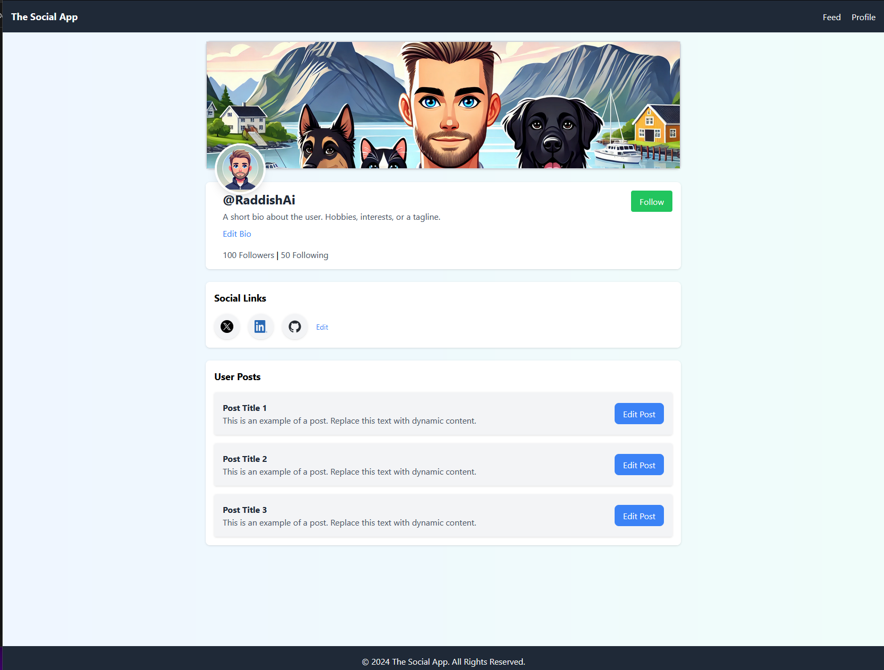

# css2.0
# The Social App
### README was created with help from the amazing ChatGPT.

Welcome to **The Social App**! This project is a responsive front-end for a social media application, designed and built with **HTML**, **TailwindCSS**, and **SASS**. The app features an authentication page, feed page, and profile page, delivering a clean and modern user experience.

---


## Description
Welcome to my personal portfolio website, where I showcase my projects, skills, and experience in web development. The site is designed to highlight my work and accomplishments in a professional and user-friendly way.

---

## 🚀 Features

- **Authentication Page**: 
  - Login and register functionality with form validation.
  - Password requirements: minimum 8 characters.
  
- **Feed Page**: 
  - Search and sort posts.
  - Create new posts.
  - Posts are displayed vertically in a clean, responsive layout.

- **Profile Page**: 
  - Includes a profile banner, profile picture, and user bio.
  - Allows editing of social media links and bio.
  - Posts section with an edit option for individual posts.
  - Profile banner and picture can be enlarged when clicked.

- **Responsive Design**: 
  - Optimized for all screen sizes using TailwindCSS.
  
> **Note**: Many features, like follow/unfollow and post editing, are only stored locally and do not persist.

---

## 🛠️ Technologies

- HTML for structuring the front-end pages.
- TailwindCSS for styling and responsive layouts.
- SASS for preprocessing and modularizing CSS.
- Netlify for hosting and deployment.

---

## 📦 Installation and Setup

### Prerequisites
Make sure you have the following installed:
- [Node.js](https://nodejs.org/) (v14 or higher)
- [NPM](https://www.npmjs.com/)

### Development Mode
To start a local development server and watch for changes, run:
```
npm run dev
```

### Build for Production
To compile and minify the project for production, run:
```
npm run build
```

---

## 📁 Project Structure

```
social-app/
├── feed/               # Feed page
│   └── index.html      # HTML for the feed page
├── profile/            # Profile page
│   └── index.html      # HTML for the profile page
├── src/                # Source folder for TailwindCSS and SASS
│   ├── input.css       # TailwindCSS input file
│   ├── output.css      # Compiled TailwindCSS file
├── assets/             # Images and icons
├── index.html          # Authentication page
├── package.json        # NPM configuration file
├── tailwind.config.js  # TailwindCSS configuration
└── README.md           # Project documentation
```

---

## 🌐 Live Demo

Check out the live version of the project:
- The Social App: https://socialpageraddish.netlify.app/

---

## 🤝 Contributions

Contributions are welcome! Feel free to fork the project, make improvements, and submit a pull request.

---

## Special thanks to
- **DALL·E**: Generated images used for profile banners and other visuals.
- Special thanks to:
  - My girlfriend, for always supporting me and helping troubleshoot.
  - My former line manager, Oliver Dipple, for his guidance and mentorship.
  - My teachers, for their invaluable support.
  - ChatGPT, for sparring with me during development.

---

## Contact Me

- [LinkedIn](https://www.linkedin.com/in/petter-r%C3%B8nning-80602613a/)
- [Portfolio](https://raddishaisportfolio.netlify.app/)
- [Email](mailto:petter.arbeid@gmail.com)

---